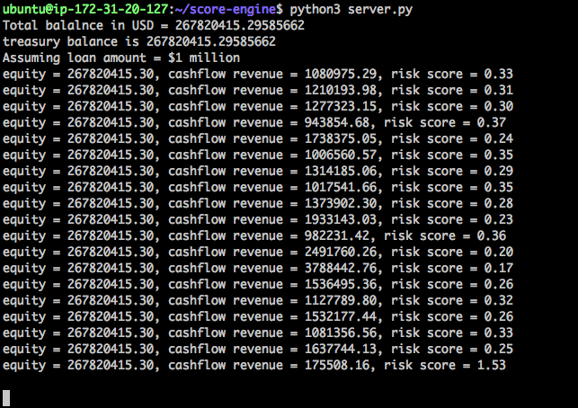
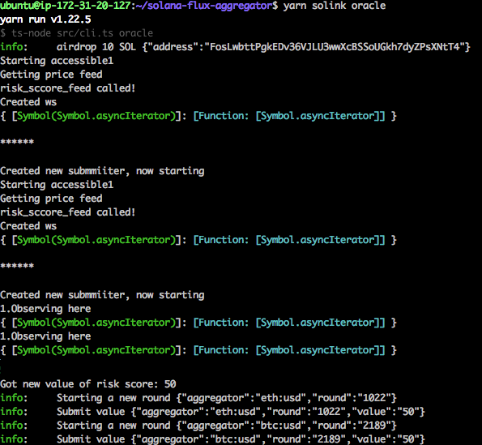

# solana-hackathon

This repository contains the code that calculates risk score for a given 3rd party. It utilizes subgraph indexes from the Graph and etherscan APIs to fetch statistics about sushiswap (and other protocols). A custom risk algorithm is used that inputs the liquidity, cashflow and other such statistics to output a risk score. A websocket server makes the risk score available for any oracle. Daily monitoring is planned to keep the risk score constantly updated.

Here is an example of the risk scores generated for sushiswap -

The solana-flux-aggregator is used as an oracle to read the risk scores from the computation engine. It is slightly modified to read the risk score using websockets from the tornado server launched previously. The aggregator picks up a risk score value of 50% in the screenshot below -

